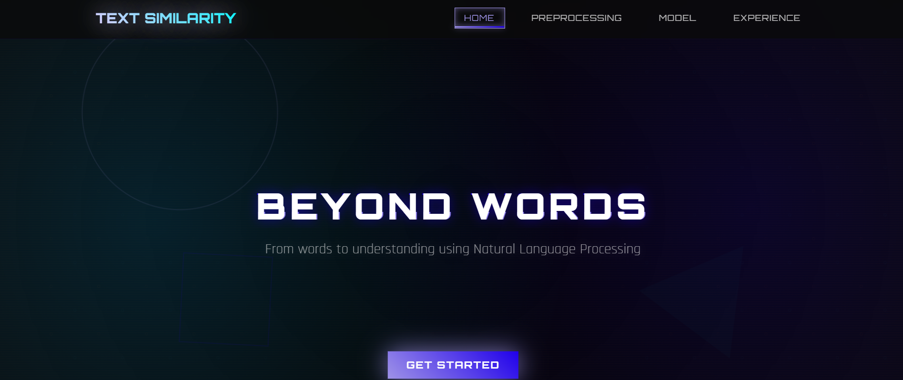
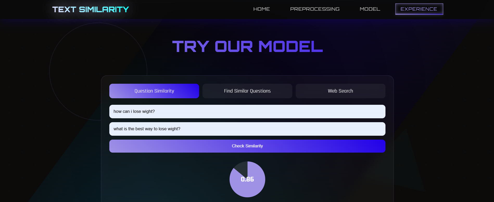
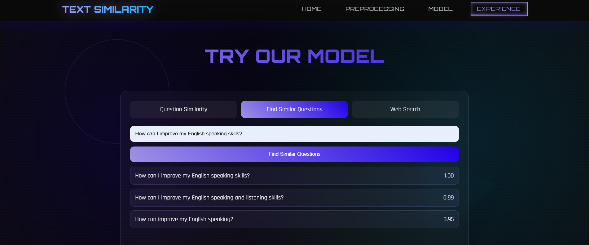
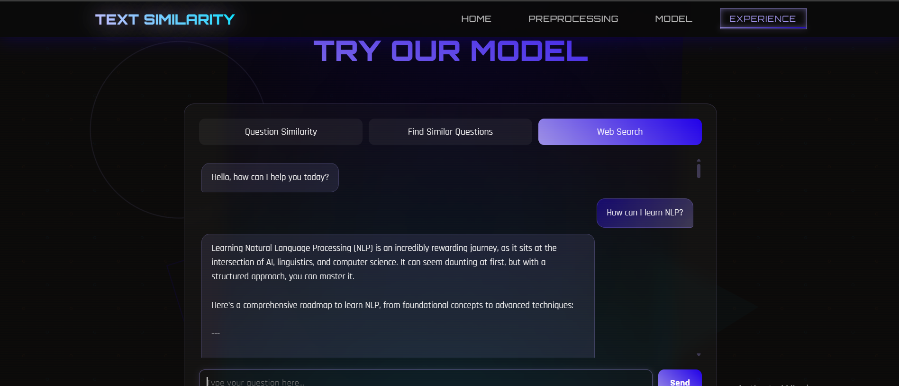

# 🧠 Text Similarity

### AI-Powered Question Similarity & Semantic Search Platform

[](https://python.org)
[](https://flask.palletsprojects.com/)
[](https://lightgbm.readthedocs.io/)
[](https://ai.google.dev/)
[](LICENSE)

> **Go beyond keyword matching — understand the meaning behind every question.**
> A full-stack NLP application that combines semantic similarity detection, intelligent question retrieval, and Gemini AI assistance to help users discover relevant information faster.


---

## 📸 Demo

### 🏠 Home Page



---

### 🔍 Question Similarity



---

### 🔎 Find Similar Questions



---

### 🤖 AI Chatbot



## 🧠 What Is This?

**Text Similarity** is an end-to-end Natural Language Processing application designed to understand semantic similarity between questions instead of relying on exact keyword matching.

The system combines **TF-IDF**, **feature engineering**, and a **LightGBM classifier** to determine whether two questions express the same meaning.

Beyond similarity prediction, the application also provides semantic search functionality that retrieves the most relevant questions from the dataset, similar to how Google Search returns related results.

To further enhance the user experience, the application integrates **Google Gemini AI**, allowing users to ask questions directly through an intelligent chatbot.

### Key Differentiators

* 🤖 Gemini AI Chat Integration
* 🔍 Semantic Question Search
* 🧠 NLP-based Question Similarity Detection
* ⚡ Real-time Predictions
* 📊 Interactive Dataset Visualization
* 🎯 LightGBM Classification Model
* 📚 Advanced Text Preprocessing Pipeline

---

## 🏗️ Architecture & Tech Stack

```text
Text-Similarity/
├── Backend/
├── app.py
├── model.pkl
├── vectorizer.pkl
├── frontend/
│   ├── index.html
│   ├── style.css
│   └── script.js
├── notebook.ipynb
├── requirements.txt
└── assets/
```

| Layer                  | Technology                            |
| ---------------------- | ------------------------------------- |
| **Frontend**           | HTML5, CSS3, JavaScript               |
| **Backend**            | Flask                                 |
| **Machine Learning**   | LightGBM                              |
| **NLP**                | NLTK, Scikit-learn                    |
| **Vectorization**      | TF-IDF                                |
| **Similarity Metrics** | Cosine Similarity, Jaccard Similarity |
| **AI Integration**     | Google Gemini API                     |

---

## ✨ Features

### 🔍 Question Similarity

Compare two questions and instantly receive:

* Similarity prediction
* Confidence score
* Semantic similarity analysis
* Duplicate / Non-Duplicate classification

---

### 🔎 Find Similar Questions

Enter a single question and retrieve:

* Top 3 most similar questions
* Ranked by similarity score
* Fast semantic retrieval
* Google-like search experience

---

### 🤖 AI Chatbot

Ask Gemini AI about anything you want like its your Assistant

---

### 📊 NLP Analysis

Explore dataset insights through interactive visualizations:

| Visualization                   | Insight                                    |
| ------------------------------- | ------------------------------------------ |
| ☁️ WordCloud                    | Most frequent words                        |
| 📏 Question Length Distribution | Length analysis of Question 1 & Question 2 |
| 📈 Duplicate Analysis           | Duplicate question ratio                   |
| 📊 Exploratory Data Analysis    | Dataset statistics                         |

---

## 🧹 Text Preprocessing Pipeline

Before training, each question passes through several NLP preprocessing steps:

| Step                        | Purpose                         |
| --------------------------- | ------------------------------- |
| Lowercasing                 | Normalize text                  |
| URL Removal                 | Remove unnecessary links        |
| Stopword Removal            | Remove common words             |
| Lemmatization               | Reduce words to their base form |
| Cleaning Special Characters | Remove noisy symbols            |

---

## 🧠 Feature Engineering

The model combines multiple handcrafted NLP features:

| Feature                    | Description                    |
| -------------------------- | ------------------------------ |
| TF-IDF                     | Text vectorization             |
| Cosine Similarity          | Semantic similarity score      |
| Jaccard Similarity         | Token overlap                  |
| Question Length Difference | Difference in sentence lengths |

---

## 📂 Dataset

The project uses the **Quora Question Pairs** dataset.

### Dataset Summary

| Property | Value                     |
| -------- | ------------------------- |
| Dataset  | Quora Question Pairs      |
| Samples  | 400,000+ Question Pairs   |

---

## 🤖 Model Details

The semantic similarity model was trained using:

* **Algorithm:** LightGBM Classifier
* **Dataset:** Quora Question Pairs
* **Vectorization:** TF-IDF
* **Similarity Metrics:** Cosine Similarity & Jaccard Similarity
* **Feature Engineering:** Multiple handcrafted NLP features

### Model Performance

| Metric    |    Score |
| --------- | -------: |
| Accuracy  |  **85%** |
| Precision | **0.68** |
| Recall    | **0.87** |
| F1 Score  | **0.76** |

---

## 📂 Project Workflow

```text
User Question
      │
      ▼
Text Preprocessing
      │
      ▼
Feature Engineering
(TF-IDF + Similarity Features)
      │
      ▼
LightGBM Model
      │
      ├──────────────► Similarity Prediction
      │
      ├──────────────► Find Top Similar Questions
      │
      └──────────────► Gemini AI Chat Assistant
```

---

## 🚀 Getting Started

### Prerequisites

Before running the project, make sure you have:

* Python **3.10** or later
* A **Google Gemini API Key**

---

### 1. Create a Virtual Environment (Recommended)

**Windows**

```bash
python -m venv venv
venv\Scripts\activate
```

**macOS / Linux**

```bash
python3 -m venv venv
source venv/bin/activate
```

---

### 2. Install the requirements

---

### 3. Get Your Gemini API Key

1. Go to **Google AI Studio**:
   https://aistudio.google.com/

2. Sign in with your Google account.

3. Click **Get API Key**.

4. Create a new API key.

5. Copy your generated key.

---

### 4. Set the Environment Variable

**Windows PowerShell**

```powershell
$env:GEMINI_API_KEY="YOUR_GEMINI_API_KEY"
```

**macOS / Linux**

```bash
export GEMINI_API_KEY="YOUR_GEMINI_API_KEY"
```

---

### 5. Run the Application

```bash
python app.py
```

---

### 6. Open Your Browser

Navigate to:

```
http://localhost:5000
```

The application is now ready to use.

---


## 🔮 Future Improvements

* [ ] Sentence Transformers (BERT)
* [ ] Multilingual similarity detection
* [ ] Voice input support
* [ ] PDF semantic search
* [ ] Search history
* [ ] User authentication
* [ ] Docker support
* [ ] GitHub Actions CI/CD
* [ ] Model comparison (LightGBM vs XGBoost)

---

## 👥 Team

This project was developed collaboratively by a team of 6 members.

---


<div align="center">

⭐ **If this project helped you, consider giving it a star !** ⭐

</div>
